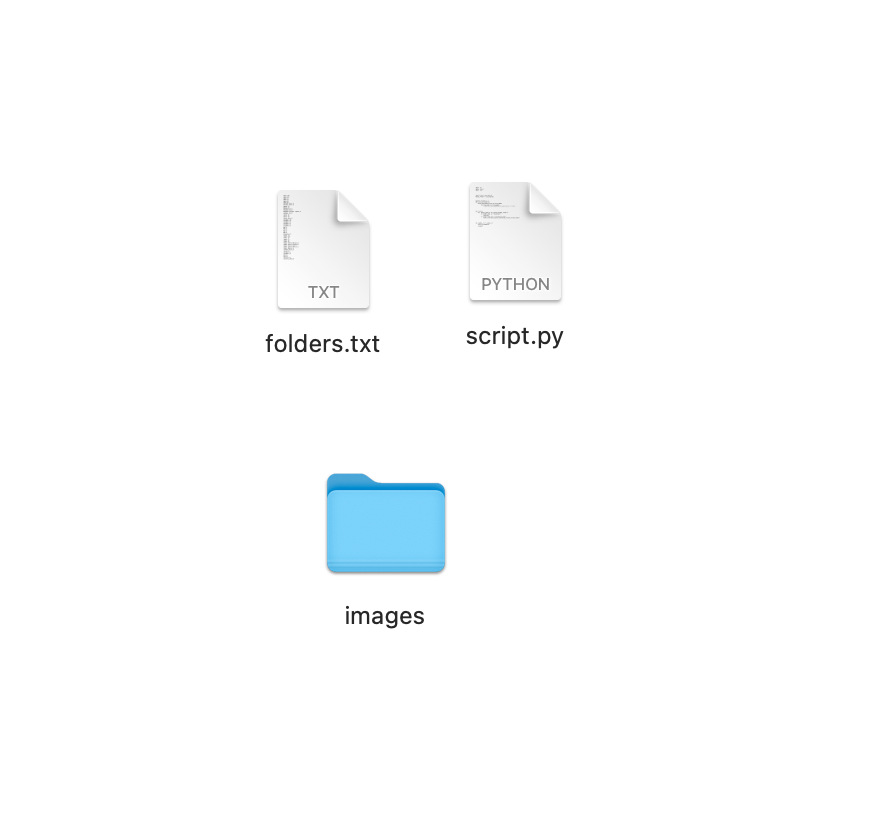

This Script useful to clean folder from folders that you don't need.

Using: 
1.put script beside to file(the file that you need to clean) 
2.make list of files that you should clean
3.run script in such way: python3 script.py list_of_folders.txt target_folder

